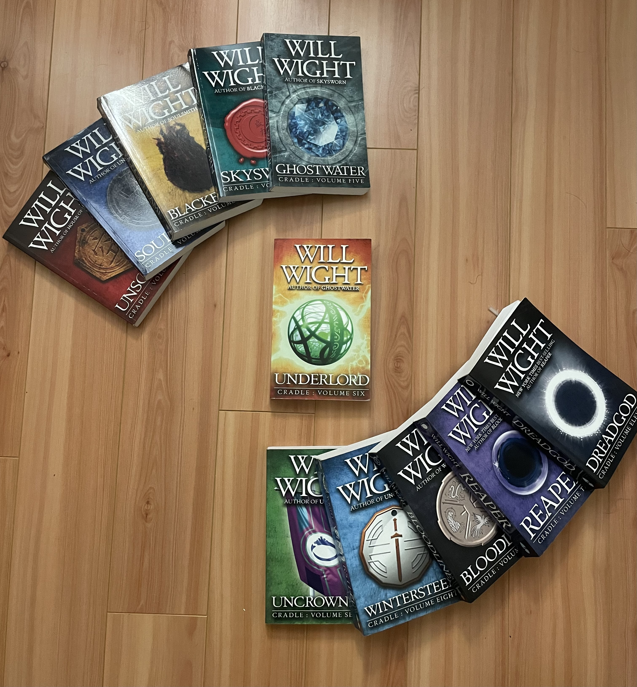

j<!DOCTYPE html>
<html>
  <head>
    <title> Some interesting Fantasy books to read.</title>
  </head>
  <body>
    <h1>
      Welcome!
    </h1>
    <h2>
      This is a small library that I am setting up that will be showcasing some cool or interesting books that I have read.
    </h2>
     
     
     
    <h2>
      <strong> DISCLAIMER </strong>
    </h2>
    

      The author of these books, J.K Rowling, has been in hot water as of late, following some previous statements about her political beliefs on both women and gender identity. If you do not wish to read or support her in any way then perhaps skip over this? If this either doesn't bother you or you want to just read the story then you are welcome to continue.
    

    <h3>
      The Harry Potter Series - Authored by J.K. Rowling
    </h3>
    
    <h4>
      Image Credit: Hung Chieh Tsai on <a href="https://www.flickr.com/photos/bibicall/2061292757" target="_blank">Flickr</a>
    </h4>
     
     
    

      One of the classics of the more modern take on the Fantasy or Sci Fi Genre, these stories follow the tale of a young boy who finds out that he is a wizard after living with his relatives that are regular          people. These relatives treat him horribly. Thankfully for him, he is enrolled into a wizarding school. Over his thime there are the school over the years, he will uncover dark secrets, make new friends,          and learn some powerful spells, but will it be enough to stop the evil brewing in the background?
    

     
     
     
     
     
    <h3>
      The Unsouled Series or Cradle Series - Authored by Will Wight
    </h3>
    <!-- DOWNLOAD THE FILES ONTO THE COMPUTER, THEN ADD THEM TO THE REPO. THEN COMMIT THE CHANGE TO THE REPO ALSO DON'T FORGET WAYBOUND-->
    
    <h4>
      Image Credit: Derek Luc
    </h4>
     
     
    

      This series was started in June of 2016 and ran all the way until June 4, 2023. The story follows a young boy in a world of magics, where every one would harness the "auras" around them to use certain abilities. A simple way to think of this as is a RPG of sorts. In order for the people of this world to harness the auras, they need either a large or deep enough soul. He was born as an "Unsouled", or some one with such a small soul, that it might as well not exist. This doesn't hinder him as we follow him as he meets new friends, makes new foes, and navigates this world with his wit and his resourcefulness to progress in the world, and possibly even out of it.
    

     
     
     
     
     
    <h3>
      The Stormlight Archive - Authored by Brandon Sanderson
    </h3>
    <!--REMEMBER TO TAKE PHOTOS OF THE STORMLIGHT ARCHIVE AND TO REMEMBER HOW TO INSERT THEM-->
    
    <h4>
      Image Credit: Derek Luc
    </h4>
     
     
    

      A broken soldier, turned a slave. Forced to work on carrying bridges for a high prince. But perhaps he isn't as broken as he believes or at least he will have to. In the past the Knights Radiant stood against evil, but they have been gone for 2000 years. And now there is evil brewing and a plot is forming. An order is needed to save this Shattered Plane. Will he or others rise to the occasion, to harness the Storm? Or will they be torn down Odium and be consumed by hatred.
    

     
    

      The world of the Stormlight Archvie is a meticulously crafted world by Brandon Sanderson. A fleshed out world in the Cosmere universe, that has a system of power based on the mystical power of Stormlight. This power comes from the never ending, always moving storm that roams across the world of Roshar. Spirits, called Spren, embody the power of ideals and nature, and these are the key, the question is the key to what? If you want to find out, read them for yourself.
    

       
     
     
     
     
    <h4>
      Small Disclaimer, there are three boks in the series so far (maybe more to come). but I have only read the first 2, so I will not be able to comment on the third book.
    </h4>
     
    <h3>
      City of Ghosts, Tunnel of Bones, Bridge of Souls - Authored by V.E. Schwab
    </h3>
    
     
    <h4>
      Image Credit: <a href="https://www.vernonlibrarysupplies.com/product/_12320422/middle_grade_books" target="_blank"> Vernon Library Supplies</a>
    </h4>
     
     
    

      The series follows a young girl named Cassie, who is inexplicable able os see ghosts. She and her poltergeist friend, Jacob, have fun adventures as they wander around and slip in and out of the world of spirits and ghosts. Her parents are film producers that make a series that explores places that are supposedly haunted, great fun for both Cassie and Jacob
    

  </body>
</html>
